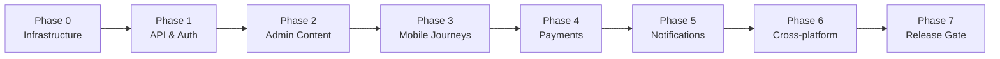

# WOPP — End-to-End Validation Plan

**Platform:** Women and Men of Passion and Purpose (WOP) Ministry Platform  
**Version:** 0.1.0 (pre-production)  
**Document owner:** QA / Engineering  
**Last updated:** 2026-06-17  
**Audience:** QA engineers, technical leads, release managers, product owners

---

## 1. Purpose & scope

This document defines the **master end-to-end (E2E) validation framework** for staging and production release readiness. It orchestrates mobile, admin, API, payment, and infrastructure validation across all implemented modules.

### In scope

| Layer | Components |
|-------|------------|
| Mobile | Flutter app (`apps/mobile-flutter`, `com.ministrymobile.app`) |
| Admin | Next.js dashboard (`apps/admin-web`, port 3001) |
| API | NestJS (`services/api`, prefix `/api/v1`, port 4000) |
| Realtime | WebSocket service (port 4100, namespace `/realtime`) |
| Data | PostgreSQL + Prisma |
| Cache | Redis |
| Notifications | Firebase FCM + in-app notifications |
| Payments | Flutterwave (subscription + ebook checkout) |

### Implemented modules (validation required)

Authentication · Users · Announcements · Events · Clips · eBooks/Library · Subscriptions · Payments · Notifications · Push · Policies · Programs · Mentorship · Analytics · Realtime

### Out of scope (this release window)

- iOS APNs production certificate validation (deferred)
- Admin `/content` hub (placeholder only)
- Stripe / Paystack payment providers (not registered)
- Mobile “Coming Soon” features (Sermons, Donations, Live Streaming, etc.)

### Companion documents

| Document | Purpose |
|----------|---------|
| `MOBILE_SMOKE_TEST_CHECKLIST.md` | Device-level mobile validation |
| `ADMIN_SMOKE_TEST_CHECKLIST.md` | Admin dashboard validation |
| `API_VALIDATION_CHECKLIST.md` | REST API contract & RBAC validation |
| `PAYMENT_VALIDATION_CHECKLIST.md` | Flutterwave checkout, webhooks, entitlements |
| `RELEASE_BLOCKERS_CHECKLIST.md` | Hard gates that block release |
| `RELEASE_READINESS_SCORECARD.md` | Weighted scoring for go/no-go |
| `BROADCAST_PUSH_VERIFICATION_CHECKLIST.md` | Admin broadcast → FCM deep-dive |
| `DEVICE_SMOKE_TEST_PLAN.md` | Push notification device smoke tests |
| `docs/release-checklist.md` | Critical-path infrastructure gate |

---

## 2. Severity classification

All test cases use this severity model for defect triage and release decisions.

| Severity | Definition | Release impact |
|----------|------------|----------------|
| **Critical** | Data loss, security breach, payment/entitlement failure, auth bypass, complete module unusable | **Block release** |
| **High** | Core user journey broken; no workaround; affects majority of users | **Block release** unless signed risk acceptance |
| **Medium** | Feature partially broken; workaround exists; UX degradation | Release with tracked fix |
| **Low** | Cosmetic, copy, non-blocking edge case | Release; backlog |

### Pass/fail rules

| Result | Criteria |
|--------|----------|
| **PASS** | Observed behavior matches expected result; evidence captured |
| **FAIL** | Behavior deviates; severity assigned; defect logged with ID |
| **BLOCKED** | Cannot execute (env, credentials, data missing) — treat as release risk |
| **N/A** | Not applicable to target environment or release slice |

---

## 3. Environments & prerequisites

### 3.1 Target environments

| Environment | Purpose | URL pattern |
|-------------|---------|-------------|
| **Local (Docker Compose)** | Developer smoke | `http://localhost:4000/api/v1` |
| **Staging** | Primary E2E gate | `https://staging-api.<domain>/api/v1` |
| **Production** | Pre-launch smoke only | Production URLs (limited test accounts) |

### 3.2 Infrastructure health (pre-flight)

Execute before any E2E suite. All must **PASS** (Critical).

| Check | Command / action | Expected |
|-------|------------------|----------|
| API health | `GET /api/v1/health` | `200`, `{ status: "ok" }` |
| PostgreSQL | Docker health / `pg_isready` | healthy |
| Redis | Docker health / `redis-cli ping` | `PONG` |
| WebSocket health | `GET /api/v1/realtime/health` (ADMIN JWT) | connection stats returned |
| Admin web | Load `/login` | 200, login form renders |
| Flutter build | `flutter build apk` or `flutter build ios` | success, 0 errors |

**Screenshot:** API health JSON response + Docker compose status.

### 3.3 Test data requirements

Maintain a **Staging Test Data Sheet** (spreadsheet or secure doc) with:

| Asset | Minimum count | Notes |
|-------|---------------|-------|
| Test users | 5 | `USER`×2, `MODERATOR`×1, `ADMIN`×1, `SUPER_ADMIN`×1 |
| Published announcement | 2 | 1 featured, 1 standard |
| Published event (RSVP required) | 2 | 1 with capacity limit |
| Published clip | 2 | 1 featured; valid video URL |
| Published ebook | 2 | 1 free, 1 paid |
| Subscription plans | 2 | 1 active monthly, 1 inactive (for negative test) |
| Flutterwave test cards | Per Flutterwave sandbox docs | Success + decline scenarios |
| FCM-registered devices | 2 | 1 Android + 1 iOS (iOS deferred if APNs not ready) |
| Policy documents | 4 | Terms, Privacy, Community, Content Sharing |

**Naming convention:** Prefix test entities with `[QA]` or `qa-` for cleanup.

### 3.4 Environment variables (staging minimum)

Reference: `.env.staging.example`

| Variable group | Required for |
|----------------|--------------|
| `DATABASE_URL`, JWT secrets | All flows |
| `REDIS_URL` | Sessions, rate limit, WS adapter |
| `SMTP_*` | Password reset email |
| `FIREBASE_SERVICE_ACCOUNT_JSON` or `FCM_*` | Push delivery |
| `FLUTTERWAVE_SECRET_KEY`, `FLUTTERWAVE_WEBHOOK_SECRET` | Payments |
| `PAYMENT_REDIRECT_BASE_URL`, `API_PUBLIC_URL` | Checkout redirect |
| `CONTENT_ACCESS_SECRET` | eBook stream tokens |
| `NEXT_PUBLIC_API_BASE_URL`, `NEXT_PUBLIC_WEBSOCKET_URL` | Admin web |

### 3.5 Evidence collection standards

Every **Critical** and **High** test case requires:

1. **Screenshot** or screen recording (mobile/admin)
2. **API response** (status code + redacted body) for API tests
3. **Timestamp** and **tester name**
4. **Build/version** (mobile build number, API git SHA, admin build)
5. **Defect ID** if FAIL (Jira/Linear/GitHub issue)

Store evidence in: `qa-evidence/<release-version>/<date>/`

---

## 4. E2E validation phases



| Phase | Duration (est.) | Owner | Checklist |
|-------|-----------------|-------|-----------|
| 0 — Infrastructure | 2h | DevOps | §3.2, `RELEASE_BLOCKERS_CHECKLIST.md` §1 |
| 1 — API & Auth | 4h | Backend QA | `API_VALIDATION_CHECKLIST.md` §1–2 |
| 2 — Admin content | 6h | Admin QA | `ADMIN_SMOKE_TEST_CHECKLIST.md` |
| 3 — Mobile journeys | 8h | Mobile QA | `MOBILE_SMOKE_TEST_CHECKLIST.md` |
| 4 — Payments | 4h | Backend + QA | `PAYMENT_VALIDATION_CHECKLIST.md` |
| 5 — Notifications | 3h | Backend + Mobile | `BROADCAST_PUSH_VERIFICATION_CHECKLIST.md` |
| 6 — Cross-platform sync | 4h | QA lead | This document §5 |
| 7 — Release gate | 2h | Tech lead | `RELEASE_READINESS_SCORECARD.md` |

---

## 5. Cross-platform E2E flows

### 5.1 Authentication (Critical path)

| ID | Flow | Steps | Expected | Severity |
|----|------|-------|----------|----------|
| AUTH-E2E-01 | Register → Login → Me | Mobile register; login; profile loads | JWT issued; `/auth/me` returns user | Critical |
| AUTH-E2E-02 | Token refresh | Wait or force access expiry; app refreshes | Seamless session; no logout | Critical |
| AUTH-E2E-03 | Logout | Logout from mobile | Refresh token invalidated; protected routes blocked | High |
| AUTH-E2E-04 | Password reset | Forgot password → email → reset → login | New password works; old fails | High |
| AUTH-E2E-05 | RBAC enforcement | USER attempts admin API | 403 Forbidden | Critical |

**Screenshots:** Login success, profile screen, 403 error (admin attempt from mobile).

---

### 5.2 Announcements

| ID | Flow | Admin action | Mobile validation | Expected | Severity |
|----|------|--------------|-------------------|----------|----------|
| ANN-E2E-01 | Create & publish | Create draft → publish | Open announcements tab | Appears in list + detail | High |
| ANN-E2E-02 | Push on publish | Publish with push enabled | Device receives FCM | Push + deep link to detail | High |
| ANN-E2E-03 | Unpublish | Unpublish from admin | Refresh mobile list | Removed from public list | Medium |
| ANN-E2E-04 | Realtime | Publish while app open | List updates without manual refresh | Socket event received | Medium |

**Screenshots:** Admin publish confirmation, mobile list, push notification tray.

---

### 5.3 Events

| ID | Flow | Steps | Expected | Severity |
|----|------|-------|----------|----------|
| EVT-E2E-01 | Admin create | Create published event, RSVP required | Visible on mobile events list | High |
| EVT-E2E-02 | RSVP hydrate | RSVP on device A; kill app; reopen detail | Button shows Cancel RSVP | High |
| EVT-E2E-03 | RSVP sync | RSVP on detail; return to list | Green RSVP icon on card | High |
| EVT-E2E-04 | Cancel RSVP | Cancel on detail | Count decrements; list icon removed | High |
| EVT-E2E-05 | Capacity | Fill event to max; attempt RSVP | 409 Conflict; clear error | Medium |
| EVT-E2E-06 | Admin edit | Change title; refresh mobile | Updated title shown | Medium |

**Screenshots:** Event detail RSVP states, list RSVP icon, attendee count.

---

### 5.4 Clips

| ID | Flow | Steps | Expected | Severity |
|----|------|-------|----------|----------|
| CLP-E2E-01 | Admin upload & publish | Upload clip → publish | Appears on mobile clips tab | High |
| CLP-E2E-02 | Playback | Open clip detail; play video | Video loads and plays ≥10s | High |
| CLP-E2E-03 | Featured | Mark featured in admin | Shows in featured carousel | Medium |
| CLP-E2E-04 | Unpublish | Unpublish clip | Removed from mobile list | Medium |

**Screenshots:** Admin clip form, mobile player mid-playback.

---

### 5.5 Library / eBooks

| ID | Flow | Steps | Expected | Severity |
|----|------|-------|----------|----------|
| LIB-E2E-01 | Catalog browse | Open eBooks tab | Published ebooks listed | High |
| LIB-E2E-02 | Free access | Open free ebook → reader | PDF/reader opens | High |
| LIB-E2E-03 | Paid gate | Open paid ebook without purchase | Purchase prompt / access denied | High |
| LIB-E2E-04 | Post-purchase | Complete ebook checkout | Appears in My Library; reader opens | Critical |
| LIB-E2E-05 | Progress | Read partial; reopen | Progress restored | Medium |
| LIB-E2E-06 | Admin upload | Upload ebook in admin | Visible in mobile catalog | High |

**Screenshots:** Access denied state, library shelf, reader view.

---

### 5.6 Subscriptions & entitlements

| ID | Flow | Steps | Expected | Severity |
|----|------|-------|----------|----------|
| SUB-E2E-01 | View plans | Mobile subscriptions screen | Active plans with pricing | High |
| SUB-E2E-02 | Purchase | Checkout via Flutterwave test | Subscription active; `GET /subscriptions/me` confirms | Critical |
| SUB-E2E-03 | Entitlement | Access premium-gated content | Content unlocked | Critical |
| SUB-E2E-04 | Cancel | Cancel subscription | Status updated; access revoked at period end | High |
| SUB-E2E-05 | Expiration | Simulate/lapse subscription | Gated content blocked | High |
| SUB-E2E-06 | Renewal | Auto-renew webhook (if enabled) | Subscription extended | High |

**Screenshots:** Checkout redirect, active subscription badge, gated content before/after.

---

### 5.7 Notifications

| ID | Flow | Steps | Expected | Severity |
|----|------|-------|----------|----------|
| NTF-E2E-01 | FCM registration | Login on device | Token in `push_device_token` table | Critical |
| NTF-E2E-02 | Broadcast push | Admin broadcast PUSH channel | All registered devices receive push | Critical |
| NTF-E2E-03 | Targeted push | Admin targeted PUSH to user | Only target device receives | High |
| NTF-E2E-04 | In-app feed | Create IN_APP broadcast | Appears in mobile notifications list | High |
| NTF-E2E-05 | Read state | Mark read on mobile | `isRead: true`; persists on refresh | Medium |
| NTF-E2E-06 | Deep link | Tap push (background) | Routes to correct screen | High |

**Screenshots:** Admin broadcast form, API logs, device notification, in-app list.

---

### 5.8 Admin dashboard (summary)

Full matrix in `ADMIN_SMOKE_TEST_CHECKLIST.md`.

| Module | Create | Read | Update | Delete/Publish | Severity |
|--------|--------|------|--------|----------------|----------|
| Users | N/A | ✓ | role/status | N/A | High |
| Announcements | ✓ | ✓ | ✓ | publish/unpublish | High |
| Events | ✓ | ✓ | ✓ | publish/unpublish | High |
| Clips | ✓ | ✓ | ✓ | publish/unpublish | High |
| eBooks | ✓ | ✓ | ✓ | publish/unpublish | High |
| Subscriptions | ✓ | ✓ | ✓ | lifecycle | Critical |
| Payments | N/A | ✓ | N/A | N/A | High |
| Notifications | ✓ | ✓ | N/A | N/A | High |
| Programs | ✓ | ✓ | ✓ | publish | Medium |
| Mentorship | ✓ | ✓ | ✓ | sessions | Medium |
| Policies | ✓ | ✓ | ✓ | publish | Medium |
| Analytics | N/A | ✓ | N/A | N/A | Medium |
| Content hub | — | **FAIL (placeholder)** | — | — | Low |

---

### 5.9 Programs & Mentorship (implemented)

| ID | Flow | Expected | Severity |
|----|------|----------|----------|
| PRG-E2E-01 | Enroll in program | Enrollment state persists | Medium |
| MNT-E2E-01 | Enroll in mentorship class | Enrollment visible on detail | Medium |

---

### 5.10 Policies

| ID | Flow | Expected | Severity |
|----|------|----------|----------|
| POL-E2E-01 | User accepts required policy | Acceptance recorded; app proceeds | High |
| POL-E2E-02 | Admin publishes policy update | Mobile shows updated content | Medium |

---

## 6. Automated validation (supplement)

Run before manual E2E to catch regressions early.

```bash
# API validation runner (staging credentials required)
cd services/validation-runner
API_BASE_URL=https://staging-api.example.com/api/v1 \
VALIDATION_EMAIL=qa.user@example.com \
VALIDATION_PASSWORD=<secret> \
node src/run-all.js
```

**Expected:** All suites green in `artifacts/*.json`.

CI reference: `.github/workflows/validation.yml`

---

## 7. Defect management

| Severity | SLA to fix (pre-release) | Escalation |
|----------|--------------------------|------------|
| Critical | 24h | Tech lead + product owner |
| High | 48h | Engineering manager |
| Medium | Next sprint | Backlog |
| Low | Backlog | None |

Defect template fields: ID, severity, module, steps, expected, actual, evidence link, environment, build SHA.

---

## 8. Sign-off

| Role | Name | Date | Staging E2E | Production smoke |
|------|------|------|-------------|------------------|
| QA Lead | | | ☐ | ☐ |
| Mobile Lead | | | ☐ | ☐ |
| Backend Lead | | | ☐ | ☐ |
| Admin Lead | | | ☐ | ☐ |
| DevOps | | | ☐ | ☐ |
| Product Owner | | | ☐ | ☐ |
| Technical Lead | | | ☐ | ☐ |

**Release recommendation:** Complete `RELEASE_READINESS_SCORECARD.md` before sign-off.

---

## 9. Revision history

| Version | Date | Author | Changes |
|---------|------|--------|---------|
| 1.0 | 2026-06-17 | QA | Initial E2E validation framework |
