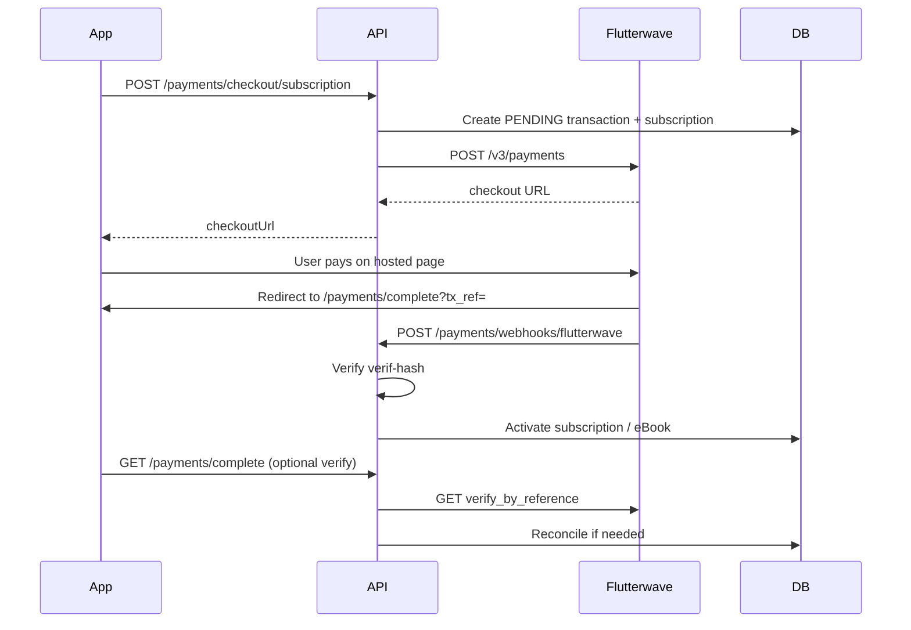

# Flutterwave Payment Readiness Report

**Date:** 2026-06-18  
**Scope:** Flutterwave payment infrastructure audit, diagnostics implementation, automated validation, and beta-readiness assessment.

---

## Executive summary

| Item | Status |
|------|--------|
| Payment flow implementation | **Complete** |
| Startup Flutterwave diagnostics | **Added** |
| Health endpoint `GET /api/v1/health/flutterwave` | **Added** |
| Local Flutterwave configuration | **Missing** |
| Live API credential validation | **Not run** (no credentials) |
| Webhook signature validation (unit tests) | **PASS** |
| Payment path unit tests | **PASS** |
| `npm run build` (`services/api`) | **PASS** |
| `npm test` (Flutterwave/payments module) | **17/17 PASS** |
| `npm test` (full suite) | **170/171 PASS** (1 pre-existing unrelated failure) |
| **Beta readiness verdict** | **FAIL** — real Flutterwave credentials not configured or validated |

---

## Readiness score: **48%**

| Category | Weight | Score | Notes |
|----------|--------|-------|-------|
| Implementation | 30% | 30/30 | Checkout, redirect, verify, webhooks, entitlements, renewal |
| Configuration | 25% | 0/25 | No Flutterwave vars in active `.env` |
| Diagnostics / observability | 20% | 20/20 | Startup logs + health endpoint + masked key preview |
| Automated tests | 15% | 15/15 | 17 payment/Flutterwave tests all pass |
| Live payment verification | 10% | 0/10 | Requires project owner Flutterwave sandbox/live keys |

---

## Implementation audit

### 1. Checkout session creation

| Aspect | Detail |
|--------|--------|
| Entry points | `POST /api/v1/payments/checkout/subscription`, `POST /api/v1/payments/checkout/ebook` |
| Service | `PaymentsService.initiateSubscriptionCheckout()` / `initiateEbookCheckout()` |
| Provider | `FlutterwaveProviderAdapter.createCheckoutSession()` |
| API call | `POST https://api.flutterwave.com/v3/payments` |
| Required env | `FLUTTERWAVE_SECRET_KEY` |
| Output | Flutterwave hosted checkout URL (`data.link`) |
| Pre-checkout DB state | Creates `PaymentTransaction` (PENDING) + `UserSubscription` (PENDING) for subscriptions |
| Guardrails | Free plans rejected; duplicate pending subscription cancelled on re-initiation |

**Verdict:** Implemented and unit-tested.

### 2. Redirect flow

| Aspect | Detail |
|--------|--------|
| Redirect URL builder | `PaymentsService.checkoutRedirectUrl()` |
| Env priority | `PAYMENT_REDIRECT_BASE_URL` → `NEXT_PUBLIC_API_BASE_URL` → `http://localhost:4000/api/v1` |
| Target | `{base}/payments/complete?tx_ref={providerReference}` |
| Completion endpoint | `GET /api/v1/payments/complete` (HTML by default; `?format=json` for JSON) |

**Verdict:** Implemented. **Owner action:** set `PAYMENT_REDIRECT_BASE_URL` to the public API base in staging/production so Flutterwave redirects users to the correct host.

### 3. Payment verification

| Aspect | Detail |
|--------|--------|
| Redirect completion | `PaymentsService.completeCheckout()` |
| Provider method | `FlutterwaveProviderAdapter.verifyTransactionByReference()` |
| API call | `GET https://api.flutterwave.com/v3/transactions/verify_by_reference?tx_ref=...` |
| Success path | Amount/currency match → `reconcileVerifiedPayment()` → entitlement activation |
| Failure path | `reconcileFailedVerification()` → failed HTML/JSON response |
| Pending path | Returns pending message when Flutterwave status unresolved |
| Idempotency | Already-SUCCESS transactions return success without re-verification |

**Verdict:** Implemented and unit-tested (success + already-completed paths).

### 4. Webhook handling

| Aspect | Detail |
|--------|--------|
| Endpoint | `POST /api/v1/payments/webhooks/flutterwave` |
| Signature header | `verif-hash` (mapped to `PaymentWebhookDto.signature`) |
| DTO builder | `PaymentsService.createWebhookDto()` |
| Processing | `PaymentsService.processWebhook()` |
| Event storage | `PaymentWebhookEvent` with `externalEventId` uniqueness |
| Duplicate handling | Returns `{ duplicate: true }` without re-processing |
| Amount validation | Rejects success when webhook amount ≠ pending transaction (`WEBHOOK_AMOUNT_MISMATCH`) |
| Admin visibility | `GET /api/v1/payments/webhook-events` (ADMIN role) |

**Verdict:** Implemented and unit-tested (signature, duplicate, amount mismatch).

### 5. Subscription activation

| Aspect | Detail |
|--------|--------|
| Triggers | Successful webhook **or** successful `completeCheckout` verification |
| Logic | `PaymentsService.reconcileVerifiedPayment()` |
| DB updates | `PaymentTransaction` → SUCCESS; `UserSubscription` → ACTIVE with period dates |
| Token storage | `flutterwaveToken` saved in subscription metadata for renewals |
| Status history | Recorded via `SubscriptionLifecycleService.recordStatusChange()` |

**Verdict:** Implemented and unit-tested.

### 6. eBook entitlement activation

| Aspect | Detail |
|--------|--------|
| Trigger | Successful payment where `metadata.purpose === 'EBOOK_PURCHASE'` |
| Logic | `ebookPurchase.upsert` on verified success (webhook or completion) |
| Pre-check | Checkout initiation rejects already-owned eBooks |

**Verdict:** Implemented and unit-tested.

### 7. Renewal flow

| Aspect | Detail |
|--------|--------|
| Service | `SubscriptionLifecycleService.processDueRenewals()` |
| Charge method | `FlutterwaveProviderAdapter.chargeTokenizedPayment()` |
| API call | `POST https://api.flutterwave.com/v3/tokenized-charges` |
| Prerequisites | Saved `flutterwaveToken` in subscription metadata + user email |
| Retry logic | Creates `RETRY_CHARGE` transaction; grace/retry scheduling on failure |
| Without token | Marks renewal failed with explicit message |

**Verdict:** Implemented in lifecycle service. **Not live-tested** — requires prior successful subscription checkout that stores a token.

---

## Webhook signature validation

| Aspect | Detail |
|--------|--------|
| Mechanism | Plain equality: `dto.signature === FLUTTERWAVE_WEBHOOK_SECRET` |
| Header | Flutterwave `verif-hash` |
| Missing secret | Returns `{ isValid: false, reason: 'Flutterwave webhook secret is not configured' }` |
| Invalid signature | HTTP 400 `WEBHOOK_SIGNATURE_INVALID` before any DB writes |
| Tests | `flutterwave.provider.spec.ts` (3 tests), `payments.service.spec.ts` (invalid signature) |

**Note:** This matches Flutterwave's documented `verif-hash` approach (shared secret comparison, not HMAC body signing). Ensure the dashboard webhook secret matches `FLUTTERWAVE_WEBHOOK_SECRET` exactly.

**Verdict:** Validation logic correct and tested. Live webhook delivery not yet confirmed.

---

## Environment requirements

| Variable | Required | Purpose | Local `.env` status |
|----------|----------|---------|---------------------|
| `FLUTTERWAVE_SECRET_KEY` | **Yes** | Bearer token for checkout, verify, tokenized charges | **Not set** |
| `FLUTTERWAVE_WEBHOOK_SECRET` | **Yes** | `verif-hash` comparison for inbound webhooks | **Not set** |
| `PAYMENT_REDIRECT_BASE_URL` | **Recommended** | Public base URL for post-payment redirect | **Not set** (falls back to `NEXT_PUBLIC_API_BASE_URL` or localhost) |

Documented in `services/api/.env.example`:

```
FLUTTERWAVE_SECRET_KEY=
FLUTTERWAVE_WEBHOOK_SECRET=
PAYMENT_REDIRECT_BASE_URL=http://localhost:4000/api/v1
```

---

## Diagnostics added (this audit)

| Component | File | Purpose |
|-----------|------|---------|
| Config resolver | `flutterwave-config.util.ts` | Validates env vars, resolves redirect URL, masks secrets |
| Readiness service | `flutterwave-readiness.service.ts` | Startup logs + optional live API credential probe |
| Health controller | `flutterwave-health.controller.ts` | `GET /api/v1/health/flutterwave` |

### Startup log behavior

| Condition | Log message |
|-----------|-------------|
| `FLUTTERWAVE_SECRET_KEY` missing | `Flutterwave not configured (missing: FLUTTERWAVE_SECRET_KEY, ...)` |
| Key present | `Flutterwave configured — secretKey=FLWS***xxxx webhookSecret=set|missing redirectBaseUrl=...` |
| API probe success | `Flutterwave API connection test passed` |
| API probe failure | `Flutterwave API connection test failed: ...` |

### Health endpoint response shape

```
GET /api/v1/health/flutterwave
```

```json
{
  "status": "not_configured | not_ready | ready",
  "flutterwave": {
    "ready": false,
    "provider": "NOT_CONFIGURED | FLUTTERWAVE",
    "configured": false,
    "webhookReady": false,
    "connectionTest": "skipped | passed | failed",
    "connectionError": null,
    "missingVariables": ["FLUTTERWAVE_SECRET_KEY", "..."],
    "redirectBaseUrl": "...",
    "secretKeyPreview": "FLWS***xxxx",
    "webhookSecretConfigured": false,
    "capabilities": {
      "checkout": false,
      "verification": false,
      "webhooks": false,
      "subscriptionRenewal": false
    }
  },
  "timestamp": "2026-06-18T..."
}
```

`ready: true` requires all three vars configured **and** live API credential probe passing.

---

## Validation results

### Automated unit / integration tests

| Test area | File | Result |
|-----------|------|--------|
| Config resolver | `flutterwave-config.util.spec.ts` | **5/5 PASS** |
| Readiness service | `flutterwave-readiness.service.spec.ts` | **2/2 PASS** |
| Webhook signature | `flutterwave.provider.spec.ts` | **3/3 PASS** |
| Invalid webhook signature | `payments.service.spec.ts` | **PASS** |
| Duplicate webhook idempotency | `payments.service.spec.ts` | **PASS** |
| Subscription activation on success | `payments.service.spec.ts` | **PASS** |
| Amount mismatch rejection | `payments.service.spec.ts` | **PASS** |
| eBook entitlement on success | `payments.service.spec.ts` | **PASS** |
| Checkout initiation | `payments.service.spec.ts` | **PASS** |
| Completion redirect (already done) | `payments.service.spec.ts` | **PASS** |
| Completion redirect (verify + activate) | `payments.service.spec.ts` | **PASS** |

### Scenario coverage matrix

| Scenario | Automated test | Live environment |
|----------|----------------|------------------|
| Successful payment (webhook) | **PASS** | Not tested |
| Successful payment (redirect verify) | **PASS** | Not tested |
| Failed payment | Partial (verification failure path in code) | Not tested |
| Duplicate webhook | **PASS** | Not tested |
| Invalid webhook signature | **PASS** | Not tested |
| Subscription activation | **PASS** | Not tested |
| eBook purchase activation | **PASS** | Not tested |
| Tokenized renewal | Code present in lifecycle service | Not tested |

### Build and test commands

```bash
cd services/api
npm run build   # PASS
npm test        # 170/171 PASS
```

**Pre-existing failure (unrelated):** `policies.service.spec.ts` — `acceptances.map` where `acceptances` is undefined (mock missing `policyAcceptance.findMany`).

---

## Remaining owner actions

1. **Obtain Flutterwave credentials** — Create or use existing Flutterwave dashboard app; copy secret key and webhook hash.
2. **Configure environment** — Set in staging/production (and local for sandbox testing):
   - `FLUTTERWAVE_SECRET_KEY`
   - `FLUTTERWAVE_WEBHOOK_SECRET`
   - `PAYMENT_REDIRECT_BASE_URL` (public HTTPS API base, e.g. `https://api.yourdomain.com/api/v1`)
3. **Register webhook URL** — In Flutterwave dashboard: `https://{your-api-host}/api/v1/payments/webhooks/flutterwave`
4. **Verify health endpoint** — After deploy, call `GET /api/v1/health/flutterwave` and confirm `status: "ready"`.
5. **Sandbox end-to-end test** — Run one subscription checkout and one eBook checkout; confirm redirect, completion page, webhook receipt, and entitlement in app.
6. **Confirm renewal token capture** — Complete a subscription payment and verify `flutterwaveToken` is stored in subscription metadata before testing auto-renewal.
7. **Monitor webhook events** — Use `GET /api/v1/payments/webhook-events` (admin) during initial rollout.

---

## Test plan (manual / staging)

### Prerequisites

- [ ] Flutterwave sandbox (or live) keys configured
- [ ] API deployed with public HTTPS URL
- [ ] Webhook URL registered in Flutterwave dashboard
- [ ] Test user account in mobile app
- [ ] Active paid subscription plan and paid eBook in database

### Checkout and redirect

- [ ] `POST /payments/checkout/subscription` returns `checkoutUrl`
- [ ] User completes payment on Flutterwave hosted page
- [ ] Browser redirects to `/payments/complete?tx_ref=...`
- [ ] Completion page shows success (or `?format=json` returns success payload)

### Webhook path

- [ ] Flutterwave sends webhook to `/payments/webhooks/flutterwave`
- [ ] `verif-hash` matches configured secret
- [ ] `PaymentWebhookEvent` created with `PROCESSED` status
- [ ] Duplicate delivery returns `duplicate: true` without double activation

### Entitlements

- [ ] Subscription: user subscription status becomes `ACTIVE` in app
- [ ] eBook: `ebookPurchase` record exists; content accessible
- [ ] Failed/cancelled payment: transaction `FAILED`; no entitlement granted

### Renewal (optional for beta)

- [ ] Subscription metadata contains `flutterwaveToken` after first payment
- [ ] Lifecycle job charges token on period end (sandbox)
- [ ] Failed renewal enters grace/retry per lifecycle rules

### Health / ops

- [ ] Startup log shows `Flutterwave configured`
- [ ] `GET /health/flutterwave` returns `ready` with `connectionTest: passed`

---

## Architecture flow (reference)



---

## Beta readiness verdict

### **FAIL**

**Reason:** Payment infrastructure is fully implemented and covered by automated tests, but **no real Flutterwave credentials are configured in the active environment**, and **no live checkout, webhook, or renewal transaction has been validated** against Flutterwave's API.

**To reach PASS:**

1. Configure all three environment variables in the target beta environment.
2. Confirm `GET /api/v1/health/flutterwave` returns `status: "ready"`.
3. Complete at least one successful sandbox subscription payment and one eBook payment end-to-end.
4. Confirm webhook delivery and duplicate handling with real Flutterwave events.

Implementation readiness is high; operational/credential readiness is the blocking gap.
