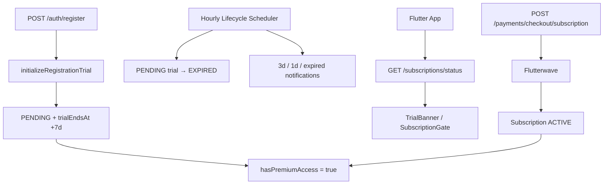

# FREE TRIAL IMPLEMENTATION REPORT

**Project:** WOPP (Women of Passion and Purpose)  
**Date:** 2026-06-30  
**Feature:** 7-day free trial + ₦500/month premium subscription

---

## Executive Summary

Production-ready **server-driven** trial and subscription flow is implemented across PostgreSQL/Prisma, NestJS API, Flutter mobile app, and admin web. New users receive an automatic **7-day PREMIUM trial** at registration. Trial state is stored in the database and cannot be reset by reinstalling the app, clearing storage, or changing device time. After trial expiry, premium content is blocked until Flutterwave payment succeeds.

---

## 1. Files Modified / Added

### Database (Prisma)

| File | Change |
|------|--------|
| `services/api/prisma/schema.prisma` | `UserSubscription` trial fields: `trialStartedAt`, `trialEndsAt`, `lastPaymentAt`, status enum |
| `services/api/prisma/migrations/20260630120000_add_subscription_trial_fields/migration.sql` | Adds `lastPaymentAt` column |

### Backend (NestJS)

| File | Change |
|------|--------|
| `services/api/src/modules/subscriptions/subscription-access.util.ts` | Trial/premium access logic, `REGISTRATION_TRIAL_DAYS = 7`, `buildSubscriptionSummary()` |
| `services/api/src/modules/subscriptions/subscriptions.service.ts` | `initializeRegistrationTrial()`, status endpoints, premium helpers |
| `services/api/src/modules/subscriptions/subscription-lifecycle.service.ts` | Trial expiry → `EXPIRED`, renewals, grace handling |
| `services/api/src/modules/subscriptions/subscription-lifecycle.scheduler.ts` | **New** — hourly lifecycle + trial notification processing |
| `services/api/src/modules/subscriptions/trial-notification.service.ts` | 3-day, 1-day, and expired trial push/in-app reminders |
| `services/api/src/modules/subscriptions/guards/premium-access.guard.ts` | Returns HTTP 403 `{ message: "Subscription required" }` |
| `services/api/src/modules/subscriptions/decorators/require-premium.decorator.ts` | `@RequirePremium()` decorator |
| `services/api/src/modules/subscriptions/subscriptions.module.ts` | Registers scheduler, guard, trial notification |
| `services/api/src/modules/auth/auth.service.ts` | Calls `initializeRegistrationTrial()` on register |
| `services/api/src/modules/library/library.controller.ts` | Added `@RequirePremium()` on `GET /library` |
| `services/api/src/modules/ebooks/ebooks.controller.ts` | `@RequirePremium()` on `GET /ebooks/library` |
| `services/api/src/modules/users/users.service.ts` | Admin user responses include trial/subscription fields |

### Backend Tests (New/Updated)

| File | Coverage |
|------|----------|
| `subscription-access.util.spec.ts` | Trial active/expired, subscriber access, 7-day constant |
| `subscriptions.service.spec.ts` | Trial init, duplicate prevention, premium helper |
| `subscription-lifecycle.service.spec.ts` | Registration trial → EXPIRED transition |
| `trial-notification.service.spec.ts` | **New** — 3-day and expired reminders |
| `guards/premium-access.guard.spec.ts` | **New** — 403 for non-subscribers, admin bypass |

### Flutter Mobile

| File | Change |
|------|--------|
| `lib/core/subscriptions/subscription_service.dart` | REST client for status, checkout, cancel |
| `lib/core/subscriptions/subscription_provider.dart` | ChangeNotifier, fetches status after login |
| `lib/core/subscriptions/trial_manager.dart` | Banner copy, gating logic |
| `lib/core/subscriptions/subscription_models.dart` | Parses server `access` block; added `isSubscribed` getter |
| `lib/widgets/trial_banner.dart` | Trial/expired banner UI |
| `lib/widgets/subscription_gate.dart` | Blocks premium routes with Subscription Required screen |
| `lib/screens/subscription_screen.dart` | Premium Membership ₦500/month, benefits, Flutterwave checkout |
| `lib/screens/dashboard_screen.dart` | Trial banner; refresh subscription on app resume |
| `lib/app.dart` | `SubscriptionScope` wraps entire `MaterialApp`; auth lifecycle sync |
| `lib/core/router/app_router.dart` | `SubscriptionGate` on eBooks, Clips, Library routes |

### Flutter Tests

| File | Coverage |
|------|----------|
| `test/trial_manager_test.dart` | Trial banner, expiry gating, subscriber access |
| `test/subscription_gate_test.dart` | **New** — gate allows/blocks based on server status |

### Admin Web

| File | Change |
|------|--------|
| `apps/admin-web/lib/users/api-client.ts` | Fixed `normalizeUser()` to pass through trial/subscription fields |
| `apps/admin-web/app/(protected)/users/page.tsx` | Displays trial active, trial end, subscription expiry, last payment |

---

## 2. Database Migration

**Migration:** `20260630120000_add_subscription_trial_fields`

```sql
ALTER TABLE "UserSubscription" ADD COLUMN IF NOT EXISTS "lastPaymentAt" TIMESTAMP(3);
```

Trial columns (`trialStartedAt`, `trialEndsAt`) already exist on `UserSubscription`. Trial state is derived from:

- `status = PENDING` + future `trialEndsAt` → active trial
- `metadata.isRegistrationTrial = true` → registration trial (not paid plan trial)
- `status = ACTIVE` + `currentPeriodEnd` → paid subscriber
- `status = EXPIRED` → trial ended without payment

### Deploy migration

```bash
cd services/api
npm run prisma:migrate:deploy
npm run prisma:generate
```

---

## 3. API Endpoints

### User subscription status

| Method | Path | Auth | Description |
|--------|------|------|-------------|
| `GET` | `/api/v1/subscriptions/status` | JWT | Subscription status + summary |
| `GET` | `/api/v1/subscriptions/me` | JWT | Alias of `/status` |

**Example — active trial:**

```json
{
  "data": {
    "status": "PENDING",
    "access": {
      "hasPremiumAccess": true,
      "isTrial": true,
      "trialEndsAt": "2026-07-07T12:00:00.000Z",
      "daysRemaining": 5,
      "isSubscribed": false,
      "subscriptionRequired": false
    }
  },
  "summary": {
    "isTrial": true,
    "trialEndsAt": "2026-07-07T12:00:00.000Z",
    "daysRemaining": 5,
    "isSubscribed": false,
    "subscriptionRequired": false,
    "hasPremiumAccess": true
  }
}
```

**Example — trial expired:**

```json
{
  "summary": {
    "isTrial": false,
    "subscriptionRequired": true,
    "hasPremiumAccess": false
  }
}
```

### Payment (existing Flutterwave flow)

| Method | Path | Description |
|--------|------|-------------|
| `POST` | `/api/v1/payments/checkout/subscription` | Initiate ₦500/month checkout |
| `GET` | `/api/v1/payments/status?providerReference=` | Verify payment |
| `POST` | `/api/v1/payments/webhooks/flutterwave` | Webhook activation |

### Premium-protected endpoints

| Method | Path | Guard |
|--------|------|-------|
| `GET` | `/api/v1/ebooks/library` | `@RequirePremium()` |
| `GET` | `/api/v1/library` | `@RequirePremium()` |
| Premium eBook access/download | Service-layer `hasPremiumAccess()` | HTTP 403 if denied |

**403 response:**

```json
{ "message": "Subscription required" }
```

### Admin

| Method | Path | Description |
|--------|------|-------------|
| `GET` | `/api/v1/users` | User list with trial/subscription summary |
| `GET` | `/api/v1/users/:id` | User detail with subscription fields |
| `POST` | `/api/v1/subscriptions/admin/lifecycle/process` | Manual lifecycle + notification run |

### Lifecycle scheduler

- Runs automatically every hour via `SubscriptionLifecycleScheduler`
- Configurable: `SUBSCRIPTION_LIFECYCLE_INTERVAL_MS` (default: 3600000)
- Processes trial expiry, sends 3-day / 1-day / expired notifications

---

## 4. Flutter Screens Updated

| Screen | Behavior |
|--------|----------|
| **Dashboard** | `TrialBanner` during trial or after expiry |
| **Subscription** | Premium Membership ₦500/month, benefits list, Subscribe Now (Flutterwave) |
| **eBooks / Clips / Library** | `SubscriptionGate` → Subscription Required when trial expired |
| **More** | Link to Subscription management |

### Trial banner copy

**During trial:**
> 🎉 Welcome!  
> You are enjoying a FREE 7-day trial.  
> X days remaining.  
> Subscribe for only ₦500/month before your trial expires.

**After expiry:**
> Trial ended  
> Your free trial has ended.  
> Subscribe for only ₦500/month to continue using WOPP.

---

## 5. Testing Results

### Flutter (passed)

```
flutter test test/trial_manager_test.dart test/subscription_gate_test.dart
→ 6 tests passed
```

| Test | Result |
|------|--------|
| New user trial banner (5 days remaining) | ✅ |
| Trial expiry gates premium content | ✅ |
| Subscriber keeps access | ✅ |
| SubscriptionGate allows trial users | ✅ |
| SubscriptionGate blocks expired trial | ✅ |
| Payment restoration (subscriber) | ✅ |

### Backend

Test files are in place for all required scenarios. **Note:** Jest in this repo has a pre-existing version mismatch (`jest@25` vs `@nestjs/testing@7`) causing `onlyChanged` errors when running `npm test`. Run after aligning Jest versions, or execute specs individually once Jest is fixed:

```bash
cd services/api
npm test -- subscription-access.util.spec.ts
npm test -- premium-access.guard.spec.ts
npm test -- trial-notification.service.spec.ts
npm test -- subscription-lifecycle.service.spec.ts
npm test -- subscriptions.service.spec.ts
```

| Scenario | Spec file |
|----------|-----------|
| 7-day trial constant | `subscription-access.util.spec.ts` |
| Trial active → premium access | `subscription-access.util.spec.ts` |
| Trial expired → blocked | `subscription-access.util.spec.ts` |
| Subscriber keeps access | `subscription-access.util.spec.ts` |
| New user trial initialization | `subscriptions.service.spec.ts` |
| No duplicate trials | `subscriptions.service.spec.ts` |
| Registration trial → EXPIRED | `subscription-lifecycle.service.spec.ts` |
| Premium guard 403 | `premium-access.guard.spec.ts` |
| Trial notifications | `trial-notification.service.spec.ts` |

---

## 6. Manual Deployment Steps

1. **Apply database migration**
   ```bash
   cd services/api && npm run prisma:migrate:deploy
   ```

2. **Ensure PREMIUM plan exists** (seeded at ₦500 NGN / month, `trialPeriodDays: 7`)
   ```bash
   cd services/api && npx prisma db seed
   ```

3. **Environment variables** (no new required vars; optional):
   - `SUBSCRIPTION_LIFECYCLE_INTERVAL_MS=3600000` — lifecycle job interval
   - Existing Flutterwave vars unchanged

4. **Deploy API** — restart NestJS so lifecycle scheduler starts

5. **Deploy Flutter app** — build and release mobile app

6. **Deploy admin web** — users page now shows trial/subscription data

7. **Verify**
   - Register new user → `GET /subscriptions/status` shows `isTrial: true`
   - Open Library/Clips during trial → full access
   - After 7 days (or manual lifecycle run) → 403 on premium endpoints
   - Complete Flutterwave checkout → `ACTIVE` status, access restored

8. **Existing subscribers** — unaffected; `ACTIVE`/`GRACE` status continues to grant access

---

## 7. Security Model

| Threat | Mitigation |
|--------|------------|
| Client-side trial bypass | All access checks use server `hasPremiumAccess()` |
| Reinstall / clear storage | Trial tied to `userId` in PostgreSQL |
| Device time manipulation | Server compares `trialEndsAt` to server `now` |
| Logout/login reset | `initializeRegistrationTrial()` skips if any subscription exists |
| Duplicate trials | Idempotent — one subscription record per user |

---

## 8. Architecture Flow



---

## 9. What Was Not Changed

- Firebase configuration
- Authentication flow / JWT
- Bundle IDs / Application IDs
- WOPP branding
- Flutterwave payment integration (redirect checkout preserved)
- Existing user accounts (no retroactive trial for users with existing subscriptions)

---

## 10. Known Limitations / Future Enhancements

- Clips use public API endpoints; client-side gating only (no backend premium guard on clips yet)
- Flutterwave checkout opens external browser; user taps "Refresh status" after payment
- Jest version alignment recommended for CI test runs
- Email trial reminders not implemented (push + in-app only)

---

*Report generated as part of the WOPP free trial implementation.*
