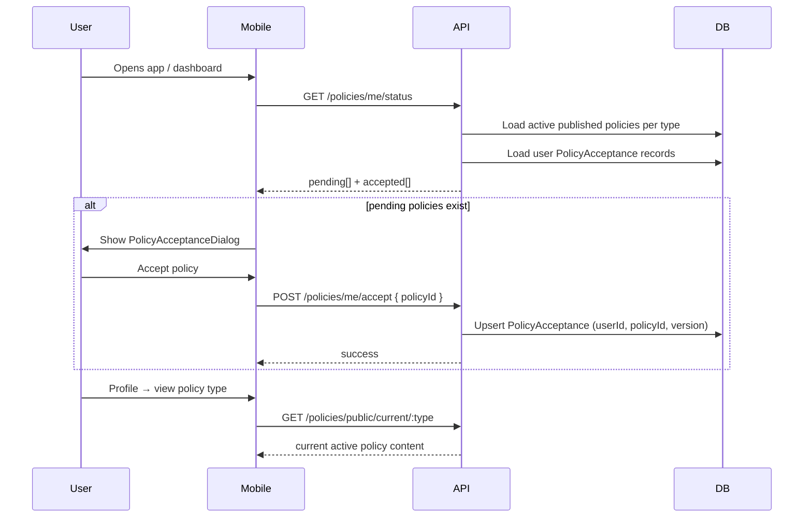

# Policies & Governance Module — Implementation Report

**Date:** June 11, 2026  
**Scope:** Backend API, admin web, Flutter mobile  
**Estimated completion:** **~92%**

---

## Summary

The Policies and Governance module is implemented end-to-end for launch readiness. It supports four policy types (Terms of Use, Privacy Policy, Community Guidelines, Content Sharing Rules), versioned publishing, user acceptance tracking, admin CRUD with rich text editing, acceptance analytics, and mobile profile access with mandatory acceptance prompts.

---

## Files Changed

### Database & Prisma

| File | Change |
|------|--------|
| `services/api/prisma/schema.prisma` | Expanded `Policy` model; added `PolicyAcceptance` model and `PolicyType` enum |
| `services/api/prisma/migrations/20260611180000_expand_policies_module/migration.sql` | **New** — enum, column migration, indexes, `PolicyAcceptance` table |

### Backend (`services/api`)

| File | Change |
|------|--------|
| `src/modules/policies/policies.service.ts` | Full rewrite — CRUD, publish/unpublish, soft delete, version history, acceptance, analytics |
| `src/modules/policies/policies.controller.ts` | Public/admin/user acceptance routes with RBAC |
| `src/modules/policies/dto/create-policy.dto.ts` | **New** |
| `src/modules/policies/dto/update-policy.dto.ts` | **New** |
| `src/modules/policies/dto/policy-query.dto.ts` | **New** |
| `src/modules/policies/dto/accept-policy.dto.ts` | **New** |
| `src/modules/policies/dto/policy-type.constants.ts` | **New** |
| `src/modules/policies/policies.service.spec.ts` | **New** — 8 unit tests |
| `src/security/route-security.spec.ts` | Updated RBAC expectations for policies routes |

### Admin Web (`apps/admin-web`)

| File | Change |
|------|--------|
| `lib/policies/types.ts` | **New** |
| `lib/policies/api-client.ts` | **New** |
| `lib/policies/hooks.ts` | **New** |
| `components/policy-rich-text-editor.tsx` | **New** — toolbar + contentEditable editor |
| `app/(protected)/policies/page.tsx` | Full management UI — CRUD, publish, history, analytics |

### Flutter Mobile (`apps/mobile-flutter`)

| File | Change |
|------|--------|
| `lib/core/policies/models/policy_models.dart` | **New** |
| `lib/core/policies/policy_service.dart` | **New** |
| `lib/screens/profile_screen.dart` | **New** — Policies section in Profile |
| `lib/screens/policy_screen.dart` | **New** — generic + type-specific screen wrappers |
| `lib/widgets/policy_acceptance_dialog.dart` | **New** — acceptance modal + version update prompt |
| `lib/core/router/app_router.dart` | Profile and policy routes |
| `lib/screens/dashboard_screen.dart` | Profile button + post-login acceptance prompt |
| `test/profile_screen_test.dart` | **New** — widget test |

---

## Feature Checklist

### Backend

| Requirement | Status |
|-------------|--------|
| Policy model (id, type, title, slug, content, version, published, effectiveDate, timestamps) | Done |
| PolicyAcceptance model (userId, policyId, version, acceptedAt) | Done |
| Public policy listing | Done (`GET /policies/public`) |
| Policy detail endpoint | Done (`GET /policies/public/:id`, `/public/slug/:slug`) |
| Current active policy endpoint | Done (`GET /policies/public/current/:type`) |
| Policy acceptance endpoint | Done (`POST /policies/me/accept`) |
| Version history | Done (`GET /policies/admin/history/:type`) |
| Admin CRUD | Done |
| Publish/unpublish | Done |
| Unit tests | Done (8 tests) |

### Admin Web

| Requirement | Status |
|-------------|--------|
| Policies management page | Done |
| Rich text editor | Done (`PolicyRichTextEditor`) |
| Version history | Done |
| Publish workflow | Done |
| Acceptance analytics | Done |

### Flutter Mobile

| Requirement | Status |
|-------------|--------|
| Policies section in Profile | Done |
| Terms of Use screen | Done |
| Privacy Policy screen | Done |
| Community Guidelines screen | Done |
| Content Sharing Rules screen | Done |
| Policy acceptance modal | Done |
| Policy version update prompt | Done (version > 1 messaging) |

---

## Policy Acceptance Workflow

**Rules:**
1. Each policy **type** has one **active** published version (highest version where `published=true` and `effectiveDate <= now`).
2. Publishing a new version **unpublishes** other published versions of the same type.
3. Acceptance is stored per `(userId, policyId)` with the accepted **version** number.
4. When a new version is published (new policy row), users without acceptance on that row appear in `pending`.
5. Admin analytics compares total users vs acceptances per active policy.

---

## Validation Results

| Command | Location | Result |
|---------|----------|--------|
| `npx prisma generate` | `services/api` | **Pass** |
| `npm run build` | `services/api` | **Pass** |
| `npm test` | `services/api` | **Pass** — 24 suites, **117 tests** |
| `npm run build` | `apps/admin-web` | **Pass** — `/policies` route included |
| `flutter analyze` | `apps/mobile-flutter` | **14 info + 0 errors** in pre-existing files; policies files clean after unused import fix |
| `flutter test test/profile_screen_test.dart` | `apps/mobile-flutter` | **Pass** — 1 test |

---

## API Surface

| Method | Route | Access |
|--------|-------|--------|
| GET | `/policies/public` | Public — current active policy per type |
| GET | `/policies/public/types` | Public |
| GET | `/policies/public/current/:type` | Public — active policy for type |
| GET | `/policies/public/:id` | Public — detail |
| GET | `/policies/public/slug/:slug` | Public — detail by slug |
| GET | `/policies/me/status` | User — pending/accepted policies |
| POST | `/policies/me/accept` | User — record acceptance |
| GET | `/policies/admin` | Moderator+ — list all |
| GET | `/policies/admin/:id` | Moderator+ — detail |
| GET | `/policies/admin/history/:type` | Moderator+ — version history |
| GET | `/policies/admin/analytics/acceptance` | Moderator+ — acceptance stats |
| POST | `/policies/admin` | Moderator+ — create |
| PATCH | `/policies/admin/:id` | Moderator+ — update |
| PATCH | `/policies/admin/:id/publish` | Moderator+ |
| PATCH | `/policies/admin/:id/unpublish` | Moderator+ |
| DELETE | `/policies/admin/:id` | Moderator+ — soft delete |

---

## Remaining Gaps (~8%)

| Gap | Impact | Notes |
|-----|--------|-------|
| **Seed policies content** | Medium | No default Terms/Privacy/Guidelines/Sharing content seeded — admin must publish before mobile acceptance flow works |
| **HTML rendering on mobile** | Low | Mobile strips HTML to plain text; admin rich text formatting is simplified on device |
| **Acceptance gate enforcement** | Medium | Modal prompts on login but does not block navigation to other tabs if dismissed (non-dismissible dialog, but no hard gate) |
| **Admin web tests** | Medium | No Vitest coverage for policies page/hooks |
| **Flutter acceptance dialog tests** | Medium | Only profile screen widget test exists |
| **Per-type acceptance on registration** | Low | Acceptance checked post-login, not during signup flow |
| **Audit export / compliance report** | Low | Analytics in admin UI only; no CSV/PDF export |

---

## Updated Completion Score

| Area | Score |
|------|-------|
| Prisma / migrations | 95% |
| Backend API & business logic | 94% |
| Admin web | 90% |
| Flutter mobile | 88% |
| Tests | 80% |
| **Overall Policies & Governance** | **~92%** |
