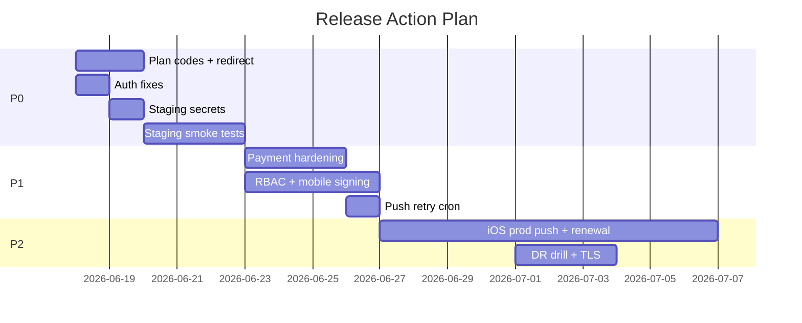

# Release Action Plan — WOPP

**Date:** 2026-06-17  
**Target:** Beta on staging → Production readiness  
**Companion:** `RELEASE_AUDIT_REPORT.md`, `RELEASE_GAP_ANALYSIS.md`  
**Principle:** Fix code/config blockers first; execute checklists second; no new features.

---

## Priority tiers

| Tier | Timeline | Goal |
|------|----------|------|
| **P0** | 1–3 days | Unblock staging beta (payments, auth, env) |
| **P1** | 1 week | Complete smoke/E2E; RBAC alignment; mobile signing |
| **P2** | 2–3 weeks | Production hardening (renewal, retry cron, premium scope) |
| **P3** | Backlog | UX polish, content hub, dependency major upgrades |

---

## P0 — Staging beta blockers (must complete before beta)

### ACT-001 — Align subscription plan codes

| Field | Value |
|-------|-------|
| **Severity** | Critical |
| **Module** | Subscriptions / Payments |
| **Description** | Mobile hardcodes `PREMIUM`/`FREE`; seed creates `BASIC_MONTHLY`; checkout returns PLAN_NOT_FOUND. |
| **Impact** | Subscription purchase completely broken on fresh/staged DB. |
| **Root cause** | Divergent constants across `subscription_service.dart`, `seed.ts`, `beta-smoke.spec.ts`. |
| **Recommended fix** | Option A: Add `PREMIUM` (+ optional `FREE`) plans to `seed.ts` matching mobile. Option B: Mobile loads plan codes dynamically from `GET /subscriptions/plans` only (remove hardcoded `_planCode`). Prefer **both**: seed + dynamic fallback. |
| **Files** | `services/api/src/prisma/seed.ts`, `apps/mobile-flutter/lib/core/subscriptions/subscription_service.dart` |
| **Effort** | 2–4 hours |
| **Release blocking** | **YES** |

---

### ACT-002 — Implement payment completion redirect

| Field | Value |
|-------|-------|
| **Severity** | Critical |
| **Module** | Payments |
| **Description** | `checkoutRedirectUrl()` returns `/payments/complete?tx_ref=` but no route exists. |
| **Impact** | Users see 404 after successful Flutterwave payment. |
| **Root cause** | Redirect URL added without controller handler. |
| **Recommended fix** | Add `GET /payments/complete` public route returning minimal HTML/JSON with tx_ref + poll instructions, **or** redirect to configured mobile deep link / admin success page. |
| **Files** | `services/api/src/modules/payments/payments.controller.ts`, `payments.service.ts` |
| **Effort** | 2–3 hours |
| **Release blocking** | **YES** |

---

### ACT-003 — Configure staging secrets (operations)

| Field | Value |
|-------|-------|
| **Severity** | Critical |
| **Module** | Infrastructure / Env |
| **Description** | FCM, Flutterwave, SMTP, JWT secrets empty in templates. |
| **Impact** | Push 503, checkout failure, password reset failure. |
| **Root cause** | Secrets intentionally not in repo; not provisioned on staging. |
| **Recommended fix** | Populate staging `.env` per `.env.staging.example` and `docs/pre-beta/EXTERNAL_SETUP.md`. Verify with health + single push + single sandbox payment. |
| **Effort** | 2–4 hours (DevOps + Flutterwave/Firebase console) |
| **Release blocking** | **YES** (for push/payment beta scope) |

---

### ACT-004 — Block disabled users at login

| Field | Value |
|-------|-------|
| **Severity** | Critical |
| **Module** | Auth |
| **Description** | `login()` does not check `user.deletedAt`. |
| **Impact** | Disabled accounts receive tokens; partial access until API rejects JWT. |
| **Root cause** | Missing guard in `auth.service.ts` login path. |
| **Recommended fix** | After password verify, if `user.deletedAt != null` throw `UnauthorizedException('Account disabled')`. Optionally revoke refresh tokens on disable in `users.service.ts`. |
| **Files** | `services/api/src/modules/auth/auth.service.ts`, `services/api/src/modules/users/users.service.ts` |
| **Effort** | 1–2 hours |
| **Release blocking** | **YES** |

---

### ACT-005 — Enforce admin minimum role at login

| Field | Value |
|-------|-------|
| **Severity** | Critical |
| **Module** | Admin / Auth |
| **Description** | Mobile USER can log into admin web and receive session cookie. |
| **Impact** | Unauthorized admin shell access; confusion; potential data exposure via misconfigured routes. |
| **Root cause** | Admin `auth-provider.tsx` accepts any `/auth/login` success without role check. |
| **Recommended fix** | After login, reject if role not in `ADMIN | SUPER_ADMIN | MODERATOR`. Clear tokens and show error. Mirror check in middleware. |
| **Files** | `apps/admin-web/providers/auth-provider.tsx`, optionally `apps/admin-web/middleware.ts` |
| **Effort** | 1–2 hours |
| **Release blocking** | **YES** |

---

### ACT-006 — Execute staging smoke tests (QA)

| Field | Value |
|-------|-------|
| **Severity** | Critical (process) |
| **Module** | QA |
| **Description** | Zero manual checklist execution on staging. |
| **Impact** | Unknown regressions in integrated environment. |
| **Recommended fix** | Run `MOBILE_SMOKE`, `ADMIN_SMOKE`, `API_VALIDATION`, `PAYMENT_VALIDATION` against staging post P0 fixes. Fill `RELEASE_READINESS_SCORECARD.md`. |
| **Effort** | 2–3 days (QA team) |
| **Release blocking** | **YES** (for beta sign-off) |

---

## P1 — Beta hardening (before wider beta / prod prep)

### ACT-007 — Webhook SUCCESS idempotency guard

| Severity | High | Module: Payments  
**Fix:** In `processWebhook()`, if transaction already `SUCCESS`, return early without resetting subscription periods.  
**Effort:** 2 hours | **Blocking:** High for prod payments

### ACT-008 — Flutterwave transaction verify fallback

| Severity | High | Module: Payments  
**Fix:** On `getStatus()` poll, if PENDING and older than N seconds, call Flutterwave verify API.  
**Effort:** 4–6 hours | **Blocking:** High

### ACT-009 — Align admin RBAC (notifications, eBooks)

| Severity | High | Module: Admin  
**Fix:** Either restrict MODERATOR from notifications UI **or** allow MODERATOR on broadcast API; align eBooks nav with API policy.  
**Effort:** 2–4 hours | **Blocking:** High for MODERATOR users

### ACT-010 — Android release signing

| Severity | Critical (store) | Module: Mobile  
**Fix:** Create release keystore, `key.properties`, update `build.gradle.kts` release signingConfig.  
**Effort:** 2–4 hours | **Blocking:** YES for Play Store

### ACT-011 — Mobile production build pipeline

| Severity | Critical | Module: Mobile  
**Fix:** Document and CI-enforce `flutter build apk/ipa --dart-define=API_BASE_URL=...`. Use `scripts/beta/build-mobile-staging.mjs`.  
**Effort:** 2 hours | **Blocking:** YES for prod mobile

### ACT-012 — Admin-web dependency remediation (SEC-003)

| Severity | Critical | Module: Security  
**Fix:** Run `npm audit`, upgrade Next.js/transitive deps or document signed acceptance.  
**Effort:** 4–16 hours (depends on breaking changes) | **Blocking:** YES per release checklist

### ACT-013 — Wire FCM push retry scheduler

| Severity | High | Module: Notifications  
**Fix:** Add `@nestjs/schedule` cron calling `PushService.retryDueDeliveries()` every 5 min, or external cron HTTP endpoint (ADMIN).  
**Effort:** 2–3 hours | **Blocking:** High for push reliability

### ACT-014 — Persist pending payment reference on mobile

| Severity | Medium | Module: Mobile/Payments  
**Fix:** Store `providerReference` in secure storage during checkout; restore on app restart.  
**Effort:** 2 hours | **Blocking:** No

### ACT-015 — Await FCM token registration

| Severity | Medium | Module: Mobile/Push  
**Fix:** `await _registerPushToken()` in `auth_provider.dart` or queue retry.  
**Effort:** 1 hour | **Blocking:** No

---

## P2 — Production launch requirements

### ACT-016 — iOS `aps-environment: production`

| Severity | Critical (prod iOS) | Effort: 1–2 hours + Apple portal | Blocking: YES for prod iOS push

### ACT-017 — Subscription renewal implementation

| Severity | Critical if auto-renew sold | Module: Subscriptions  
**Fix:** Implement real Flutterwave charge in `subscription-lifecycle.service.ts` or disable auto-renew UI until ready.  
**Effort:** 1–2 weeks | **Blocking:** YES if renewal marketed

### ACT-018 — Premium entitlement scope decision

| Severity | High | Module: Subscriptions  
**Fix:** Either add premium checks to clips/programs APIs **or** remove premium claims from UI/marketing.  
**Effort:** 3–5 days | **Blocking:** High for honest billing

### ACT-019 — `content/validate` live entitlement check

| Severity | High | Module: Subscriptions  
**Fix:** After token validation, call subscription/purchase lookup before returning success.  
**Effort:** 4 hours | **Blocking:** Medium

### ACT-020 — Backup restore drill

| Severity | High | Module: DR  
**Fix:** Execute per `docs/disaster-recovery.md`; record evidence.  
**Effort:** 4 hours | **Blocking:** High per release checklist

### ACT-021 — TLS certificates on production nginx

| Severity | High | Module: DevOps  
**Fix:** Provision Let's Encrypt or commercial certs in `infra/nginx/certs`.  
**Effort:** 2–4 hours | **Blocking:** YES for prod HTTPS

### ACT-022 — Set `CONTENT_ACCESS_SECRET` in all envs

| Severity | High | Module: eBooks  
**Fix:** Remove dev fallback path in production config validation.  
**Effort:** 1 hour | **Blocking:** High

---

## P3 — Backlog

| ID | Item | Effort |
|----|------|--------|
| ACT-023 | Admin `/content` hub implementation | 2+ weeks |
| ACT-024 | API npm audit moderate cleanup (35 vulns) | 1–2 days |
| ACT-025 | Expand admin Vitest coverage | 1 week |
| ACT-026 | Device E2E automation (Patrol / integration_test) | 2 weeks |
| ACT-027 | Stripe/Paystack removal or implementation | TBD |

---

## Execution schedule (recommended)

---

## Ownership matrix

| Owner | P0 items | P1 items |
|-------|----------|----------|
| Backend | ACT-001, 002, 004, 007, 008, 013, 017 | ACT-018, 019 |
| Mobile | ACT-011, 014, 015 | ACT-010, 016 |
| Admin-web | ACT-005, 009 | ACT-012 |
| DevOps | ACT-003, 021 | ACT-020 |
| QA | ACT-006 | Full checklist execution |

---

## Success criteria for beta exit

- [ ] ACT-001 through ACT-006 complete
- [ ] Staging payment E2E: subscription + eBook PASS
- [ ] Staging push E2E: broadcast PUSH PASS on ≥1 Android device
- [ ] `RELEASE_READINESS_SCORECARD` overall ≥ **80%**
- [ ] Zero open **Critical** blockers without signed acceptance
- [ ] Critical path 7/7 PASS on staging

---

## Success criteria for production exit

- [ ] All P1 items complete
- [ ] ACT-010, ACT-016, ACT-021 complete
- [ ] ACT-017 resolved or auto-renew disabled in product
- [ ] ACT-012 (SEC-003) resolved or accepted by security owner
- [ ] Overall readiness ≥ **90%**
- [ ] 72-hour post-deploy monitoring plan active

---

## Revision history

| Version | Date |
|---------|------|
| 1.0 | 2026-06-17 |
